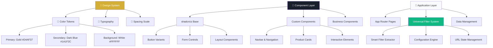

# 💎 Namah Jewellers

A modern jewelry e-commerce platform built with Next.js 15, featuring an intelligent product filtering system that automatically adapts to your inventory. Built for Namah Jewellers to showcase premium jewelry collections with seamless browsing and discovery.

## 🚀 Quick Start

```bash
# Install dependencies
bun install

# Start development server with Turbopack
bun run dev

# Build for production
bun run build

# Start production server
bun start
```

---

## 🏗️ Project Architecture

### **Tech Stack Overview**

| Technology | Version | Purpose | Documentation |
|------------|---------|---------|---------------|
| **Next.js** | 15.3.2 | Full-stack React framework | [Next.js Docs](https://nextjs.org/docs) |
| **React** | 18.3.1 | UI library with hooks | [React Docs](https://react.dev) |
| **TypeScript** | 5.x | Type safety & developer experience | [TS Handbook](https://www.typescriptlang.org/docs) |
| **Tailwind CSS** | 4.x | Utility-first CSS framework | [Tailwind v4 Docs](https://tailwindcss.com/docs) |
| **shadcn/ui** | Latest | Component library with Radix UI | [shadcn/ui Docs](https://ui.shadcn.com) |
| **Radix UI** | Latest | Accessible component primitives | [Radix Docs](https://www.radix-ui.com) |
| **Lucide React** | 0.511.0 | Icon library | [Lucide Icons](https://lucide.dev) |
| **nuqs** | Latest | Type-safe URL state management | [nuqs Docs](https://nuqs.47ng.com) |

### **Architecture Diagram**



---

## 🔧 Universal Filter System

### **🗂️ Filter System Architecture**

```
lib/
├── 📄 filter-extractor.ts    # Smart data extraction from products
└── 📄 filter-config.ts       # Centralized filter configuration

hooks/
└── 📄 use-filters.ts         # Universal filter management hook

components/filters/
├── 📄 ProductFilters.tsx     # Main filter UI (original design)
└── 📄 index.ts              # Clean exports
```

### **⚙️ Core Components**

#### **1. Smart Filter Extractor (`lib/filter-extractor.ts`)**

Automatically extracts unique filter options from product data:

```typescript
import { getCachedFilterOptions } from '@/lib/filter-extractor';

// Automatically extracts all unique options
const options = getCachedFilterOptions(products);
// Returns: categories, subCategories, genders, stamps, priceRanges, stones
```

#### **2. Configuration Engine (`lib/filter-config.ts`)**

Single source of truth for all filter behavior:

```typescript
export const FILTER_CONFIG = {
  category: {
    id: 'category',
    type: 'checkbox',
    label: 'Category',
    enabled: true,
    priority: 1,
    dynamic: true,
    defaultExpanded: true,
    filterFunction: (product, values) => {
      // Custom filtering logic
      return values.some(value => applyFilterLogic(product, value));
    }
  }
  // ... more filters
};
```

#### **3. Universal Hook (`hooks/use-filters.ts`)**

One hook replaces all complex state management:

```typescript
const {
  filteredProducts,     // Already filtered products
  resultCount,          // Number of results
  updateFilter,         // Update any filter
  clearAllFilters,      // Clear everything
  activeFilters,        // Currently active filters
  hasActiveFilters      // Boolean flag
} = useFilters();
```

### **🚀 Usage Examples**

#### **Basic Implementation**
```typescript
import { useFilters, ProductFilters } from '@/components/filters';

export default function ProductPage() {
  const { filteredProducts, resultCount } = useFilters();

  return (
    <div className="flex">
      {/* Filter sidebar with original UI */}
      <ProductFilters />

      {/* Product results */}
      <div>
        <p>{resultCount} products found</p>
        {filteredProducts.map(product => (
          <ProductCard key={product.id} product={product} />
        ))}
      </div>
    </div>
  );
}
```

#### **Adding New Filters**

To add a new filter, simply update the configuration:

```typescript
// lib/filter-config.ts
FILTER_CONFIG.availability = {
  id: 'availability',
  type: 'checkbox',
  label: 'Availability',
  enabled: true,
  priority: 7,
  dynamic: false,
  options: [
    { id: 'in-stock', label: 'In Stock', value: 'inStock', category: 'availability' },
    { id: 'pre-order', label: 'Pre-Order', value: 'preOrder', category: 'availability' }
  ],
  filterFunction: (product, values) => {
    if (!values || values.length === 0) return true;
    return values.some(value => {
      if (value === 'inStock') return product.inStock;
      if (value === 'preOrder') return product.isPreOrder;
      return true;
    });
  }
};
```

### **📊 URL State Management**

#### **Clean URL Structure**
```
Old System: /buy?category=Diamond&sub=Ring&gender=Ladies&stamp=18&price=0-50000&stones=diamond
New System: /buy?filters=category:Diamond|gender:Ladies|priceRange:0-50000|stones:diamonds
```

#### **Benefits:**
- ✅ Much cleaner URLs
- ✅ Better performance
- ✅ Easier bookmarking and sharing
- ✅ Simpler state management

### **🎨 Filter Configuration Options**

#### **Filter Types**
- **`checkbox`** - Multiple selection (Category, Gender, etc.)
- **`range`** - Single selection (Price ranges)
- **`radio`** - Single selection with radio buttons
- **`toggle`** - On/off switch

#### **Configuration Interface**
```typescript
interface FilterConfig {
  id: string;                    // Unique identifier
  type: FilterType;              // checkbox | range | radio | toggle
  label: string;                 // Display name
  enabled: boolean;              // Show/hide filter
  priority: number;              // Order (lower = first)
  dynamic: boolean;              // Extract from product data
  defaultExpanded?: boolean;     // Start open/closed

  // Static options (for non-dynamic filters)
  options?: FilterOption[];

  // Custom option generator (for dynamic filters)
  optionGenerator?: (products: Product[]) => FilterOption[];

  // Custom filter logic
  filterFunction?: (product: Product, values: any) => boolean;
}
```

### **🚨 Do's and Don'ts**

#### **✅ Do's**
```typescript
// DO: Use the universal hook
const { filteredProducts, updateFilter } = useFilters();

// DO: Follow the configuration pattern
FILTER_CONFIG.newFilter = {
  id: 'newFilter',
  type: 'checkbox',
  label: 'New Filter',
  enabled: true,
  // ...
};

// DO: Use dynamic filter extraction
const options = getCachedFilterOptions(products);

// DO: Leverage caching for performance
const memoizedResult = useMemo(() => expensiveCalculation(), [dependency]);
```

#### **❌ Don'ts**
```typescript
// DON'T: Hardcode filter options
const categories = ['Diamond', 'Gold']; // ❌ Bad

// DON'T: Use multiple URL parameters for filters
const [category] = useQueryState('category'); // ❌ Old way
const [subcategory] = useQueryState('sub'); // ❌ Old way

// DON'T: Duplicate filter logic
const filterProducts = (products) => { /* custom logic */ }; // ❌ Bad

// DON'T: Bypass the configuration system
const customFilters = []; // ❌ Bad
```

---

## 🎨 Design System & Brand Identity

### **🌈 Brand Color Palette**

| Color | Hex | OKLCH | Usage | Tailwind Classes |
|-------|-----|-------|-------|------------------|
| **Primary Gold** | `#D4AF37` | `oklch(0.7665 0.1387 91.06)` | CTAs, highlights, accents | `bg-primary`, `text-primary`, `border-primary` |
| **Secondary Blue** | `#1A1F2C` | `oklch(0.2405 0.0261 268.12)` | Headers, text, footer | `bg-secondary`, `text-secondary` |
| **Background** | `#FFFFFF` | `oklch(100% 0 0)` | Page backgrounds, cards | `bg-background`, `bg-white` |
| **Muted** | Custom | `oklch(95% 0.01 260)` | Subtle backgrounds | `bg-muted` |
| **Accent** | Gold | `oklch(0.7665 0.1387 91.06)` | Interactive elements | `bg-accent`, `text-accent-foreground` |

### **🎯 Color Usage Guidelines**

#### **✅ Recommended Patterns**
```tsx
// Primary gold for CTAs and important actions
<Button className="bg-primary text-primary-foreground hover:bg-primary/90">
  Shop Now
</Button>

// Elegant hover states inspired by navbar design
<Link className="text-gray-600 hover:text-primary p-3 rounded hover:bg-gray-50 transition-colors border border-gray-100 hover:border-primary/20">
  Menu Item
</Link>

// Subtle gold backgrounds with opacity
<div className="bg-primary/10 border border-primary/20 hover:border-primary/40">
  Highlighted Content
</div>

// Secondary dark blue for headers and important text
<h1 className="text-secondary font-bold">
  Section Header
</h1>
```

#### **❌ Patterns to Avoid**
```tsx
// DON'T use hardcoded colors
<div style={{ color: '#D4AF37' }}>Hardcoded gold</div>
<div className="text-[#1A1F2C]">Arbitrary value</div>

// DON'T use conflicting brand colors
<div className="text-amber-500">Wrong gold shade</div>
<div className="bg-blue-900">Wrong blue shade</div>

// DON'T mix design systems
<Button className="bg-yellow-400 text-blue-800">Inconsistent colors</Button>
```

---

## 📁 Project Structure

### **🗂️ Folder Organization**

```
namah-jewellers/
├── 📁 app/                      # Next.js App Router
│   ├── 📄 globals.css           # Global styles & design tokens
│   ├── 📄 layout.tsx            # Root layout with providers
│   ├── 📄 page.tsx              # Homepage
│   ├── 📁 about/                # About page
│   ├── 📁 buy/                  # Product listing with universal filters
│   ├── 📁 contact/              # Contact page
│   ├── 📁 faq/                  # FAQ page
│   ├── 📁 privacy/              # Privacy policy
│   ├── 📁 terms/                # Terms of service
│   ├── 📁 product/              # Dynamic product pages
│   │   ├── 📄 layout.tsx        # Product layout
│   │   └── 📁 [slug]/           # Dynamic routes
│   │       ├── 📄 page.tsx      # Individual product page
│   │       ├── 📄 loading.tsx   # Loading state
│   │       └── 📄 not-found.tsx # 404 state
│   └── 📁 data/                 # Type definitions & data
│       ├── 📄 types.ts          # TypeScript interfaces
│       ├── 📄 products.ts       # Product data
│       └── 📄 legal-content.ts  # Legal page content
│
├── 📁 components/                    # Reusable components
│   ├── 📁 ui/                        # shadcn/ui components
│   │   ├── 📄 price-buttons.tsx      # Price preset buttons
│   │   ├── 📄 price-range-slider.tsx # Price range slider
│   │   └── 📄 ...                    # Other UI primitives
│   │
│   ├── 📁 filters/                # Universal Filter System
│   │   ├── 📄 ProductFilters.tsx  # Main filter UI (original design)
│   │   └── 📄 index.ts            # Clean exports
│   │
│   ├── 📁 product-listing/         # Product-specific components
│   │   ├── 📄 product-card.tsx     # Product display card
│   │   ├── 📄 product-filters.tsx  # Legacy filters (replaced)
│   │   ├── 📄 product-sort.tsx     # Sort dropdown
│   │   └── 📄 pagination.tsx       # Pagination component
│   │
│   ├── 📁 product-page/             # Individual product components
│   │   ├── 📄 ImageCarousel.tsx     # Product image gallery
│   │   ├── 📄 AppointmentDialog.tsx # Booking dialog
│   │   ├── 📄 AppointmentForm.tsx   # Appointment form
│   │   └── 📄 ProductFeatures.tsx   # Product feature component
│   │
│   ├── 📁 legal/                # Legal page components
│   │   └── 📄 LegalDocument.tsx # Legal content renderer
│   ├── 📁 magicui/              # Third-party UI components
│   │   └── 📄 border-beam.tsx   # Animated border effects
│   ├── 📄 navbar.tsx            # Main navigation
│   └── 📄 footer.tsx            # Site footer
│
├── 📁 hooks/                    # Custom React hooks
│   └── 📄 use-filters.ts        # Universal filter management
│
├── 📁 lib/                      # Utility functions & core logic
│   ├── 📄 utils.ts              # cn() utility & helpers
│   ├── 📄 constants.ts          # App constants
│   ├── 📄 navigation.ts         # Navigation utilities
│   ├── 📄 filter-config.ts      # Filter configuration engine
│   └── 📄 filter-extractor.ts   # Smart data extraction
│
├── 📁 public/                   # Static assets
│   ├── 📁 images/               # Organized image assets
│   │   ├── 📁 about/            # About page images
│   │   ├── 📁 form/             # Form related images
│   │   └── 📁 jewelry/          # Product showcase images
│   ├── 📁 animated-logos/       # Animated brand elements
│   │   ├── 📄 coin.gif          # Animated coin
│   │   └── 📄 diamond.gif       # Animated diamond
│   └── 📄 *.svg                 # Icon assets
│
└── 📄 Configuration Files
    ├── 📄 components.json
    ├── 📄 next.config.ts
    ├── 📄 tsconfig.json
    ├── 📄 package.json
    └── 📄 README.md
```
